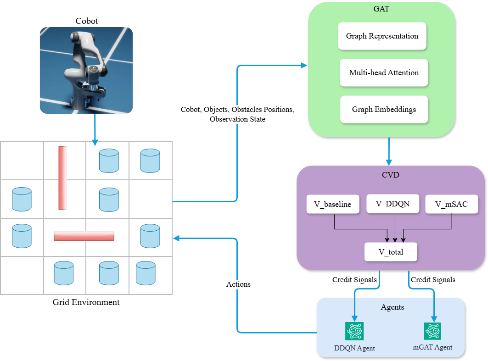

# Multiagent Reinforcement Learning for Robotic Manipulation

A comprehensive framework for developing multi-agent reinforcement learning for robotic manipulation tasks (grasping, pick and place) using NVIDIA Isaac Sim.

## Overview

Multiple agents cooperate for high-level decision making. Tasks are decomposed into specialized agents.



### Agent 1: Optimal Pick Sequence Agent

- Decides which object to pick next
- Optimizes the overall picking order
- Minimizes unnecessary motion and cycle time

### Agent 2: Spatial Rearrangement Agent

- Decides when and where to reshuffle objects
- Moves objects closer to the cobot when beneficial
- Improves future productivity and efficiency in dynamic environment

## Environment Setup

### Environment

- Grid-based workspace
- Contains cobot, multiple objects, and obstacles
- Executes selected actions and updates object positions

### State (Observation Space)

- Cobot base position
- Spatial positions of all objects
- Obstacle positions
- Distance between cobot base and objects
- Encoded as a graph representation

### Action

- Select next object to pick (DDQN agent)
- Reshuffle the object nearer to cobot (mGAT agent)

## DDQN Agent

- Grid-based environment representation: object, obstacles, container locations and cobot workspace
- State representation: spatial features such as end-effector distance, container distance, reachability and obstacle proximity
- Action space: object selection for optimal pick sequence
- Action masking for avoiding invalid actions (already picked, unreachable, blocked objects)
- Reward calculation: distance, path clearance, obstacle density, and task completion bonus
- ε-greedy exploration with exponential decay: gradually reducing random exploration and shifting towards greedy action selection during training
- Customized training for agent in grid based environment
- Learns the optimal pick sequence

## mGAT Agent

### Multiagent Graph Attention Network

- Models cobot, objects, and obstacles as a graph
- Nodes represent state information of entities
- Edges represent spatial relationships
- Uses multi-head attention to learn spatial relationships
- Generates node embeddings and global graph representation
- Shared encoder used by both agents for decision making

## Counterfactual Value Decomposition (CVD)

- Combines value functions from multiple agents
- Decomposes global reward into individual agent contributions
- V (Value Function): Expected cumulative future reward an agent can obtain

### Computes

- V_baseline: Reference value to stabilize training by measuring how much better (or worse) agent performs compared to an average or default policy
- V_DDQN: Value function for DDQN agent
- V_mSAC: Value function for mSAC agent
- Aggregates into a total value function (V_total)
- Provides structured credit assignment for coordinated learning

## State Machine with 8 Phases

### Phase 1: Pre-Pick Planning

- Filter obstacles within 30 cm
- Load grasp configurations
- Update RRT

### Phase 2: Global Approach (RRT)

- Plan collision-free path from current pose to pre-grasp position using RRT

### Phase 3: Local Descent (IK)

- Compute inverse kinematics for straight-line vertical motion
- Interpolate joint positions

### Phase 4: Grasp and Verification

- Close gripper
- Verify lift (>5 cm vertical displacement)
- Retry up to 3 times on failure

### Phase 5: Retreat

- Lift object with collision spheres expanded by 15% radius
- Plan short RRT path upward

### Phase 6: Transport to Container

- RRT path planning to container approach
- Dynamic obstacles updated via sensor fusion

### Phase 7: Placement (IK)

- Precise straight-line descent using IK
- Open gripper with controlled acceleration

### Phase 8: Return to Home

- Execute predefined safe joint configuration
- Remove temporary obstacles from planner

## Obstacle Avoidance: Lidar and Depth Sensor

### PhysX Lidar

- Mounted on cobot base, generates point-cloud data
- Masking using bounding box
- Detects the dynamic as well as static obstacles

### Depth Camera

- Stereoscopic - positioned to have a bird-eye view
- Senses the depth of the objects
- Annotator: Distance to camera

### Self-Collision Avoidance

- Robot as a kinematic tree with spheres attached to each link
- Define number of spheres with radius
- Approximate the robot's geometry to avoid self collision

## Path & Motion Planning Methods

- Rapidly-exploring Random Tree (RRT) with collision checking
- RRT with LULA kinematics solver (IK & FK)
- C-space trajectory generation


## Project Structure

### Core Directories

- `src/` - Core source code modules
  - `rl/` - Reinforcement learning implementations
    - `doubleDQN/` - Double DQN agent and replay buffer
    - `object_selection_env.py` - Custom Gymnasium environment
    - `path_estimators.py` - path planning
    - `visual_grid.py` - Grid visualization utilities
  - `controllers/` - Robot controllers (PID, impedance)
  - `manipulators/` - Robot manipulator interfaces (UR10, Franka)
  - `grippers/` - Gripper control modules (parallel, suction)
  - `sensors/` - Sensor interfaces (cameras, LiDAR)
  - `utils/` - Utility functions (splines, transformations)

- `scripts/` - Training and testing scripts
  - `Reinforcement Learning/` - RL training and evaluation
    - `doubleDQN_script/` - DDQN training scripts
    - `MASAC/` - Multi-agent SAC implementation
    - `MARL/src/gat_cvd/` - Graph Attention Network implementation
    - `rrt_rl_episode_viz.py` - RRT episode visualization
  - `RRT/` - RRT path planning scripts
  - `Cobot_Trajectory_Generator/` - Trajectory generation tools

- `assets/` - Robot models and configuration files
  - `franka_panda.urdf` - Franka Panda robot URDF
  - `franka_conservative_spheres_robot_description.yaml` - Collision spheres


## Installation

### Step 1: Clone the Repository

```bash
git clone https://github.com/falgunsinha/multiagent.git
cd multiagent
```

### Step 2: Install Python Dependencies

```bash
py -3.11 -m pip install -r requirements.txt
```

### Step 3: Install PyTorch Geometric (for GAT-CVD)

For CUDA 12.1:

```bash
pip install torch-geometric torch-scatter torch-sparse torch-cluster -f https://data.pyg.org/whl/torch-2.5.0+cu121.html
```

### Step 4: Install NVIDIA Isaac Sim 5.0.0

Follow the official NVIDIA Isaac Sim installation guide:
https://docs.omniverse.nvidia.com/isaacsim/latest/installation.html


## Training

### Train DDQN Agent (Pick Sequence)

Train DDQN with RRT in Isaac Sim:

```bash
cd "scripts/Reinforcement Learning/doubleDQN_script"
C:\isaacsim\python.bat train_rrt_isaacsim_ddqn.py --grid_size 4 --num_cubes 9 --timesteps 50000
```

### Train DDQN + mGAT Agent System (Isaac Sim)

Train the complete two-agent system with DDQN for pick sequence and mGAT for spatial rearrangement:

```bash
cd "scripts/Reinforcement Learning/MARL/src/gat_cvd"
C:\isaacsim\python.bat train_gat_cvd_isaacsim.py --grid_size 4 --num_cubes 9 --timesteps 20000 --save_freq 5000 --execute_picks
```

Parameters:
- `--grid_size`: Grid size (default: 4)
- `--num_cubes`: Number of objects (default: 9)
- `--timesteps`: Total training timesteps (default: auto-set based on grid/cubes)
- `--save_freq`: Save checkpoint every N steps (default: 5000)
- `--execute_picks`: Execute actual pick-and-place during training
- `--use_wandb`: Enable Weights & Biases logging
- `--device`: Device to use (cuda/cpu, default: cuda)

## Testing and Evaluation

### Test DDQN + mGAT System (Isaac Sim)

Test the trained GAT-CVD multi-agent system:

```bash
cd "scripts/experiments/rlmodels/mutliagent/ddqn_gatcvd"
C:\isaacsim\python.bat test_gat_cvd_isaacsim.py --episodes 50 --seeds 42 123 --grid_size 4 --num_cubes 9 --checkpoint "path/to/checkpoint.pt"
```

Parameters:
- `--episodes`: Number of episodes per model (default: 50)
- `--seeds`: Random seeds for testing (default: 42 123)
- `--grid_size`: Grid size (default: 4)
- `--num_cubes`: Number of cubes (default: 9)
- `--checkpoint`: Path to trained GAT-CVD checkpoint


## Visualization in Isaac Sim

Run the Isaac Sim visualization with RRT and PhysX Lidar/Depth Camera:

```bash
cd "scripts/Reinforcement Learning"
C:\isaacsim\python.bat cobot_rrt_physXLidar_depth_camera_rl_standalone_v2.1.py --rl_model "path/to/model.pt" --num_cubes 9 --training_grid_size 4
```

Parameters:
- `--rl_model`: Path to trained RL model (PPO: .zip, DDQN: .pt)
- `--num_cubes`: Number of cubes to spawn (default: auto-detect from model metadata)
- `--training_grid_size`: training grid size (default: auto-detect from model metadata)


